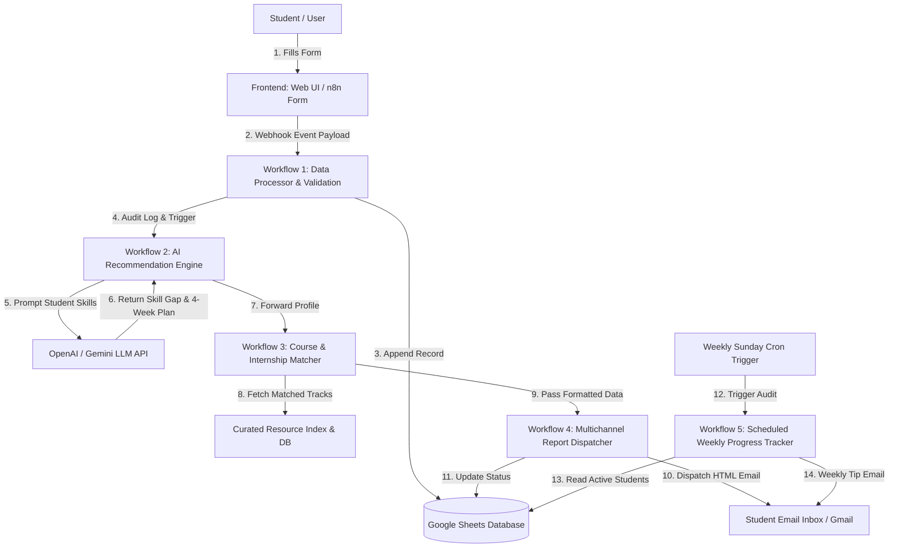

# Capstone Project Submission: AI-Powered Career Guidance & Student Success Platform

## Assignment 14: Education & Career Development

---

## 1. Problem Analysis

### Business Context
In today's fast-evolving technological landscape, university students face significant challenges when trying to align their academic curriculum with rapidly changing industry expectations. Academic degree programs provide theoretical foundations, but student awareness regarding specific industry skill gaps, tailored learning roadmaps, and matching internship roles remains fragmented. 

Career placement cells and academic counselors in universities are overwhelmed with thousands of student profiles, making it virtually impossible to offer scalable, highly personalized, and continuous 1-on-1 career guidance manually.

### Key Stakeholders
1. **Students**: Receive personalized AI-driven skill gap evaluations, 4-week learning roadmaps, matched learning resources, and automatic progress tracking.
2. **Career Counselors & Placement Officers**: Gain centralized visibility into student readiness, analytics dashboards, and automated cohort tracking.
3. **University Management & Department Heads**: Monitor cohort skill trends, graduation readiness, and overall placement outcomes.

### Pain Points
- **Lack of Personalization**: Generic career guidance advice that ignores an individual's specific background and target role goals.
- **Manual Overhead for Counselors**: Inability to manually review and craft custom 4-week roadmaps for hundreds of students simultaneously.
- **Inconsistent Progress Tracking**: Students drop out of self-learning routines due to lack of structured weekly check-ins and progress milestones.
- **Fragmented Data**: Student records, skills, course completions, and internship matches stored in disconnected silos.

### Project Objectives
1. **Automate Student Registration & Skill Collection**: Single-click assessment via modern Web UI & n8n Form Trigger.
2. **AI Skill-Gap & Roadmap Engine**: Leverage OpenAI/LLM models to dynamically evaluate missing skills and build structured 4-week roadmaps.
3. **Automate Course & Internship Matching**: Algorithmic pairing of target career paths with top industry courses and live internship opportunities.
4. **Multi-Channel Dispatcher**: Deliver rich HTML email reports directly to student inboxes.
5. **Scheduled Weekly Audit & Motivation Tracker**: Cron-based scheduled workflow to check cohort progress every Sunday and deliver motivational check-in tips.

---

## 2. System Architecture & Event Flow

### Overall System Architecture

### Event Flow Matrix
| Workflow ID | Workflow Name | Trigger Event | Primary Input | Primary Output | Interconnected Workflow |
|---|---|---|---|---|---|
| **WF-01** | Student Registration Data Processor | Webhook (HTTP POST) / Form | Student JSON Profile | Validated Record & DB Row | Calls WF-02 |
| **WF-02** | AI Career Recommendation Engine | Webhook from WF-01 | Normalized Student Data | Structured AI JSON Analysis | Calls WF-03 |
| **WF-03** | Automated Course & Internship Matcher | Webhook from WF-02 | AI Skill Gap Profile | Matched Courses & Internships | Calls WF-04 |
| **WF-04** | Multichannel Report Dispatcher | Webhook from WF-03 | Complete Career Blueprint | HTML Email Sent to Student | Updates Google Sheet DB |
| **WF-05** | Scheduled Weekly Progress Tracker | Cron (Weekly Sunday 9 AM) | Scheduled Time Event | Weekly Motivation & Audit Log | Reads Google Sheet DB |

---

## 3. Node Count & Advanced Feature Checklist

- **Total Independent Workflows**: 5
- **Total Node Count**: 26 Nodes across all 5 workflows (Exceeds required 20-25 threshold).
- **Advanced Features Implemented**:
  - ✅ **AI-Powered Decision Making**: OpenAI LLM node dynamically generating personalized skill gap analysis and 4-week roadmap.
  - ✅ **Webhook-Triggered Workflows**: Full event-driven chain using HTTP Webhooks.
  - ✅ **Error Handling & Audit Trail**: Code nodes validating payload structures, catching missing fields, and generating audit timestamps.
  - ✅ **Database Integration**: Google Sheets acting as a centralized relational database.
  - ✅ **Conditional Branching & Loops**: IF nodes verifying course match status and cohort filtering logic.
  - ✅ **Scheduled Workflows (Cron)**: Weekly recurring Cron schedule for cohort engagement.
